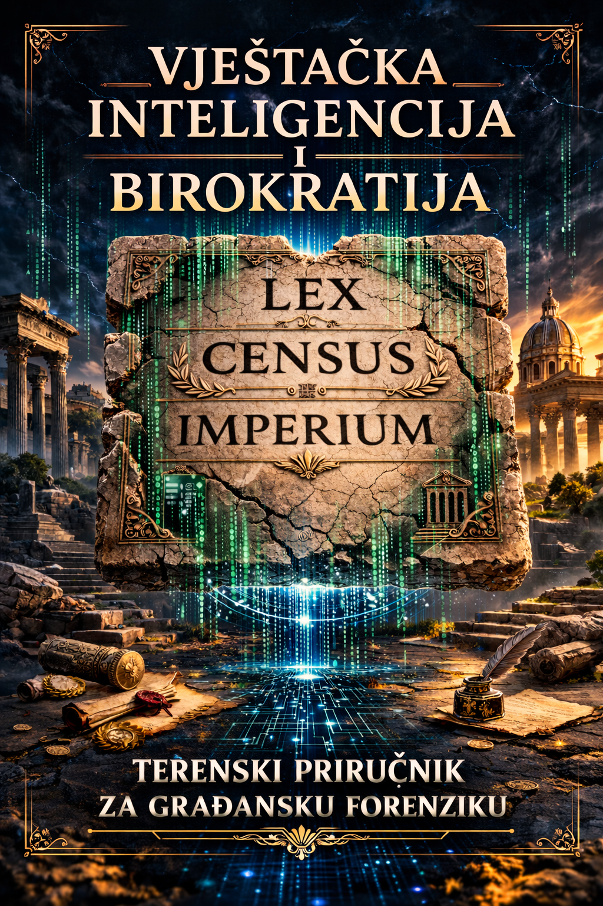

# 📑 O Priručniku: Vještačka inteligencija i birokratija

Ovaj dokument sadrži zvanične informacije o publikaciji, detalje o licenci, odricanju od odgovornosti i akademskom formatu citiranja, preuzete direktno iz impresuma knjige.

---

## 🏛️ Osnovni podaci o izdanju

* **Naslov:** Vještačka inteligencija i birokratija: Terenski priručnik za građansku forenziku
* **Autor:** Velimir Šamara
* **Izdanje:** Digitalno, otvoreno izdanje (Proširena i sistematizovana verzija materijala razvijenog u okviru radionice „AI i birokratija“)
* **Godina:** 2026.
* **Mjesto izdanja:** Bosna i Hercegovina
* **Svrha publikacije:** Unapređenje digitalne, podatkovne, medijske i AI pismenosti građana, te jačanje kapaciteta javnosti za razumijevanje i nadzor rada institucija. Publikacija je namijenjena slobodnoj distribuciji u Bosni i Hercegovini i regionu.

---

## 📜 Licenca i uslovi korišćenja

Ova publikacija je dostupna javnosti potpuno besplatno pod međunarodnom licencom **Creative Commons Autorstvo-Nekomercijalno 4.0 (CC BY-NC 4.0)**.

* ✔️ **Dozvoljeno je:** Dijeljenje, umnožavanje, preuzimanje i prilagođavanje sadržaja u edukativne i nekomercijalne svrhe.
* ❌ **Zabranjeno je:** Komercijalno korišćenje, prodaja materijala ili distribucija bez jasnog navođenja autora.
* 📌 **Obaveza:** Prilikom svakog daljeg korišćenja ili prenošenja dijelova teksta, obavezno je jasno navesti autora (`Velimir Šamara`) i izvor (`gradjanskaforenzika.org`).

---

## ⚖️ Pravna napomena (Odricanje od odgovornosti)

* **Svrha materijala:** Sadržaj ove publikacije i pratećih AI promptova objavljen je isključivo u informativne i edukativne svrhe i **ne predstavlja pravni savjet**.
* **Primjenjivost:** Autor ulaže napore da osigura tačnost informacija, ali ne garantuje njihovu potpunu primjenjivost u svakom pojedinačnom slučaju. Korištenjem ovog materijala prihvatate da to činite na sopstvenu odgovornost.
* **Odgovornost:** Autor otklanja svaku odgovornost za eventualne direktne ili indirektne posljedice nastale upotrebom ovih informacija ili AI generisanih podnesaka.
* **Uloga vještačke inteligencije:** Ova publikacija izrađena je uz korištenje savremenih alata vještačke inteligencije kao istraživačke, analitičke i uredničke podrške. AI alati služe isključivo kao analitička podrška, dok odgovornost za konačne podneske i postupanja uvijek ostaje na korisniku. AI nije zamjena za kritičko razmišljanje i konsultacije sa pravnim stručnjacima.

---

## ✍️ Kako citirati ovu publikaciju?

Ukoliko koristite metodologiju ili tekstove iz ovog priručnika u svojim istraživanjima, medijskim člancima ili akademskim radovima, koristite sljedeće formate:

* **Preporučeni akademski format citiranja:**
  > Šamara, V. (2026). *Vještačka inteligencija i birokratija: Terenski priručnik za građansku forenziku*. Digitalno otvoreno izdanje.
* **Skraćeni oblik (za fusnote):**
  > Šamara, *Vještačka inteligencija i birokratija*, 2026.

---
🔗 **Zvanični resursi projekta:** [gradjanskaforenzika.org](https://gradjanskaforenzika.org)

